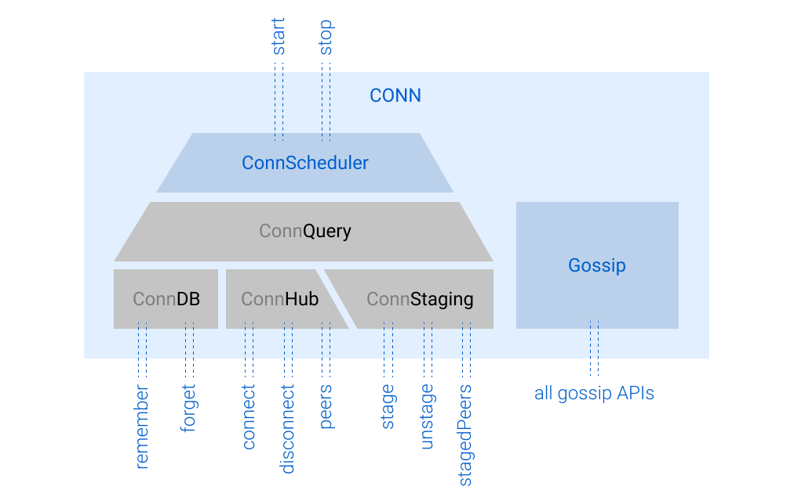

<div style="text-align:center" align="center">

# SSB CONN

### SSB plugin for establishing and managing peer connections.

</div>

Also known as *"The Gossip Refactor"*, the *CONN* (Connections Over Numerous Networks) plugin replaces the old `gossip` plugin, covering all its use cases. CONN has these responsibilities:

- Persistence of pub (and other servers) addresses (in the file `~/.ssb/conn.json`)
- Monitoring of all current connections and their state (connecting, disconnecting, etc)
- Monitoring of discovered peers and suggested connections (e.g. on LAN or Bluetooth)
- Selection and scheduling of connections and disconnections
- API compatibility with the old gossip plugin


## Installation

**Prerequisites:**

- Requires **Node.js 6.5** or higher
- Requires `secret-stack@^6.2.0`

```
npm install --save ssb-conn
```

Add this plugin to ssb-server like this:

```diff
 var createSsbServer = require('ssb-server')
     .use(require('ssb-onion'))
     .use(require('ssb-unix-socket'))
     .use(require('ssb-no-auth'))
     .use(require('ssb-plugins'))
     .use(require('ssb-master'))
+    .use(require('ssb-conn'))
     .use(require('ssb-replicate'))
     .use(require('ssb-friends'))
     // ...
```

Now you should be able to access the muxrpc APIs under `ssb.conn` and `ssb.gossip`, see next section.

## API

Under `ssb.conn.*` you can call any of these APIs in your local peer.

| API | Type | Description |
|-----|------|-------------|
| **`remember(addr, data?)`** | `sync` | Stores (in cold storage) connection information about a new peer, known by its multiserver address `addr` and additional optional `data` (as an object). |
| **`forget(addr)`** | `sync` | Removes (from cold storage) connection information about a peer known by its multiserver address `addr`. |
| **`dbPeers()`** | `sync` | Returns an Iterable of (cold stored) database "entries" (see definition below) known at the moment. Does not reactively update once the database is written to. |
| **`connect(addr, data?)`** | `async` | Connects to a peer known by its multiserver address `addr`, and stores additional optional `data` (as an object) during its connection lifespan. |
| **`disconnect(addr)`** | `async` | Disconnects a peer known by its multiserver address `addr`. |
| **`peers()`** | `source` | A pull-stream that emits an array of all connection "entries" (see definition below) whenever any connection updates (changes it state: connecting, disconnecting, connected, etc). |
| **`stage(addr, data?)`** | `sync` | Registers a suggested connection to a new peer, known by its multiserver address `addr` and additional optional `data` (as an object). |
| **`unstage(addr)`** | `sync` | Unregisters a suggested connection the peer known by its multiserver address `addr`. |
| **`stagedPeers()`** | `source` | A pull-stream that emits an array of all staged "entries" (see definition below) whenever any staging status updates (upon stage() or unstage()). |
| **`query()`** | `sync` | Returns an instance of [ConnQuery](https://github.com/staltz/ssb-conn-query). |
| **`start()`** | `sync` | Triggers the start of the connection scheduler in CONN. |
| **`stop()`** | `sync` | Stops the CONN scheduler if it is currently active. |
| **`ping()`** | `duplex` | A duplex pull-stream for periodically pinging with peers, fully compatible with `ssb.gossip.ping`. |

An "entry" is a (tuple) array with a multiserver address (string that [follows some rules](https://github.com/dominictarr/multiserver-address)) and data (an object):

```javascript
[addr, data]
```

## Gossip compatibility

The following gossip plugin APIs are available once you install CONN, but **these will emit deprecation warnings and might behave slightly different than the old gossip plugin**:

| API | Type |
|-----|------|
| **`ssb.gossip.peers()`** | `sync` |
| **`ssb.gossip.get(p)`** | `sync` |
| **`ssb.gossip.connect(p)`** | `async` |
| **`ssb.gossip.disconnect(p)`** | `async` |
| **`ssb.gossip.changes()`** | `source` |
| **`ssb.gossip.add(p, source)`** | `sync` |
| **`ssb.gossip.remove(p)`** | `sync` |
| **`ssb.gossip.ping()`** | `duplex` |
| **`ssb.gossip.reconnect()`** | `sync` |
| **`ssb.gossip.enable()`** | `sync` |
| **`ssb.gossip.disable()`** | `sync` |

If you want to use the new CONN infrastructure but preserve the same gossip behavior as before, use [`ssb-legacy-conn`](https://github.com/staltz/ssb-legacy-conn) which tries to mirror the gossip plugin, even its log messages.

## Learn more

<details>
  <summary>How CONN works (click here)</summary>
  <p>



Under the hood, CONN is based on three "pools" of peers:

- [ConnDB](https://github.com/staltz/ssb-conn-db): a persistent database of addresses to connect to
- [ConnHub](https://github.com/staltz/ssb-conn-hub): a façade API for currently active connections
- [ConnStaging](https://github.com/staltz/ssb-conn-staging): a pool of potential new connections

ConnDB contains metadata on stable servers and peers that have been successfully connectable. ConnHub is the central API that allows us to issue new connections and disconnections, as well as to track the currently active connections. ConnStaging is an in-memory ephemeral storage of new possible connections that the user might want to approve or disapprove.

Then, [ConnQuery](https://github.com/staltz/ssb-conn-query) has access to those three pools, and provides utilities to query, filter, and sort connections across all those pools.

**ConnScheduler** is an **opinionated** (⚠️) plugin that utilizes ConnQuery to select peers to connect to, then schedules connections to happen via ConnHub, as well as schedules disconnections if necessary. Being opinionated, CONN provides an easy way of replacing the default scheduler with your own scheduler, see instructions below.

There is also a **Gossip Compatibility** plugin, implementing all the legacy APIs, so that other SSB plugins that call these APIs will continue to function as normal.

When you install the ssb-plugin, it will actually setup three plugins:

```
[conn, connScheduler, gossip]
```

  </p>
</details>

<details>
  <summary>Opinions built into the default scheduler (click here)</summary>
  <p>

The default scheduler is roughly the same as the legacy ssb-gossip plugin, with some opinions removed and others added. The scheduler has two parts: discovery setup on startup, and periodic connections/disconnections.

**Discovery setup:**

- Read the SSB log and look for "pub" messages, and `remember` them
- Listen to a stream of Bluetooth nearby devices, and `stage` them

**Periodic connections/disconnections:**

- With (10sec) exponential backoff, try to connect to peers that we have connected successfully before
- With (30sec) exponential backoff, try to connect to peers that we have never with connected before
- With (1min) exponential backoff, try to connect to peers that have we always failed to connect with
- With (4min) exponential backoff, try to connect to peers that seem to run a legacy version of the gossip plugin

In none of the cases above shall we connect to a peer that we block.

- Automatically connect to (five) staged peers we follow
- Disconnect from connected peers that have just been blocked
- Unstage LAN peers that haven't been updated in ConnStaging in 10 seconds
- Unstage Bluetooth peers that haven't been updated in ConnStaging in 30 seconds
- Wait some 10 seconds before disconnecting a "connecting" peer

**Other events:**

- Upon wakeup (from computer 'sleep'), fully reset the ConnHub
- Upon network (interface) changes, fully reset the ConnHub
- Upon a disconnection, try to connect to some peer (section above)

<ul></ul>

  </p>
</details>

<details>
  <summary>How to build your own ConnScheduler (click here)</summary>
  <p>

To experiment with your own opinions for establishing connections, you can make your own ConnScheduler, which is just a typical SSB plugin. You can write in the traditional style (like other SSB plugins), or with OOP decorators. The example below uses OOP decorators.

Here is the basic shape of the scheduler:

```javascript
import {plugin, muxrpc} from 'secret-stack-decorators';

@plugin('1.0.0')
module.exports = class ConnScheduler {
  constructor(ssb, config) {
    // basic setup here
    this.ssb = ssb;
  }

  @muxrpc('sync')
  public start = () => {
    // this is called when the scheduler should begin scheduling connections

    // You have access to CONN core here:
    const query = this.ssb.conn.query();
    this.ssb.conn.stage(addr);
    this.ssb.conn.disconnect(addr);
    // ...
  }

  @muxrpc('sync')
  public stop = () => {
    // this is called when the scheduler should cancel its jobs
  }
}
```

Note that the name of the plugin must be **exactly `ConnScheduler`** (or `connScheduler`) and it **must have the methods start() and stop()**, because the CONN core will try to use your scheduler under those names. The rest of the contents of the ConnScheduler class are up to you, you can use private methods, etc.

When you're done building your scheduler, you can export it together with CONN core and the gossip compatibility plugin like this:

```js
var CONN = require('ssb-conn/core')
var Gossip = require('ssb-conn/compat')
var ConnScheduler = require('./my-scheduler')

module.exports = [CONN, ConnScheduler, Gossip]
```

That array is a valid secret-stack plugin which you can `.use()` in ssb-server.

**Pro tip:** when implementing your ConnScheduler, you have access to `ssb.conn.*` APIs, but if you need more precision, you can access lower level APIs belonging to ConnDB, ConnHub, and ConnStaging:

- `ssb.conn.internalConnDB().*`
- `ssb.conn.internalConnHub().*`
- `ssb.conn.internalConnStaging().*`

<ul></ul>

  </p>
</details>

<details>
  <summary>Why was the gossip plugin refactored? (click here)</summary>
  <p>

The legacy gossip plugin is one of the oldest parts of the SSB stack in Node.js, and it contained several old opinions. It wasn't designed with multiserver in mind, so it made a lot of assumptions that peers have `host`/`port` fields. Nowadays with Bluetooth and other unusual modes of connectivity, that assumption breaks down often.

The gossip plugin also did not have the concept of "staging", which is useful for ephemeral connections (LAN or Bluetooth) in spaces that may have many strangers. So the gossip plugin tended to connect as soon as possible to any peer discovered.

Also, since the gossip plugin was a monolith, it had all these concerns (cold persistence, in-memory tracking of current connections, ephemeral peers, scheduling, old and new style addresses) squashed into one file, making it hard and brittle to change the code.

The objectives with CONN were to:

- Untangle the codebase into modular components with single responsibilities
- Standardize the assumption that addresses are always multiserver addresses
- All "pools" (DB, Hub, Staging) are key-value pairs `[address, dataObject]`
- Make scheduling easily customizable but provide an opinionated default

<ul></ul>

  </p>
</details>

## License

MIT
